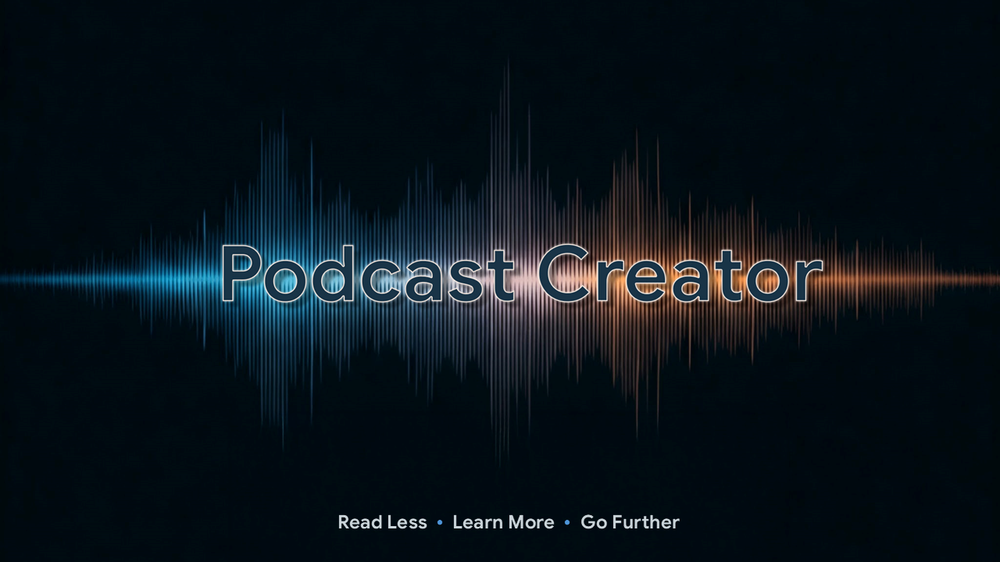
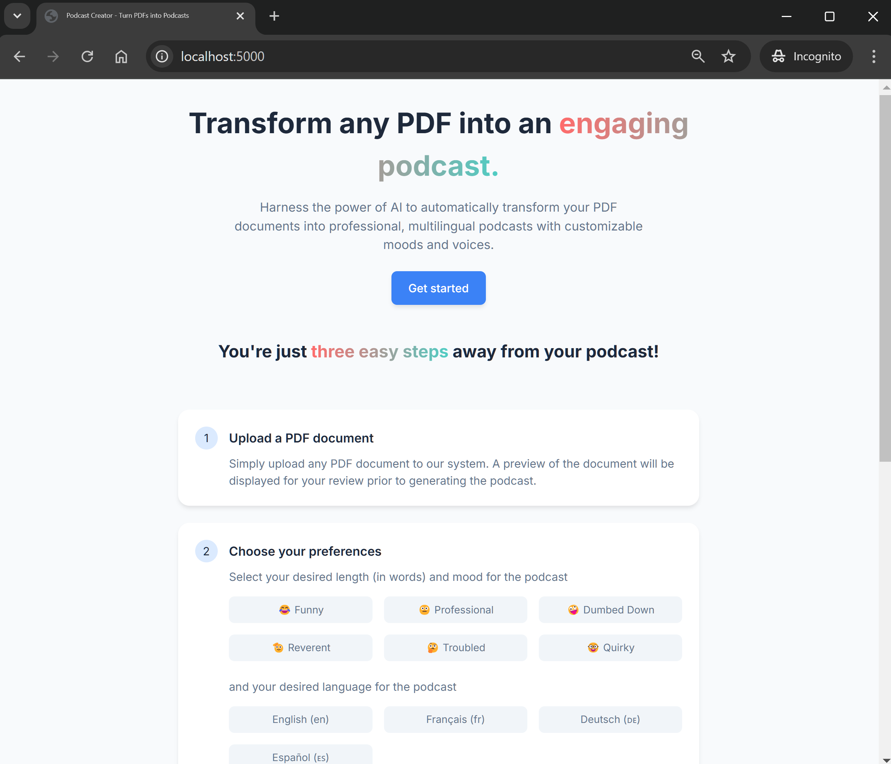

Podcast Creator
===================

[](https://github.com/cbenge509/strategic_sales_analytics/) [](https://pypi.org/project/google-generativeai/)


### Final Project for E6998 Design for Gen AI - Fall 2024
#### Author : [Cristopher Benge](https://cbenge509.github.io/)

<br><br>
Columbia University in the City of New York

------

## Description

Podcast Creator allows you to transform your PDF's into podcasts in a way that lets you customize the tone (or 'mood'), the length, and voices.  Translation support from English to French, German, and Spanish is built-in, and the final result also provides you with the generated Script.  

## Pitch & Demo Video
[](https://youtu.be/kDvkTqz4VwU)

## Technical Details

Podcast Creator is a local Python/HTML/JavaScript/CSS/Flask hosted web application that utilizes Google Vertex AI (Text-to-Speech API), Google Cloud Translation API, and Anthropic Claude/Sonnet 3.5 to transform PDFs into interesting podcast scripts.  Pydub is used to stitch together segments of the podcast script into lively conversation with natural sounding transitions between host and guest.

I used Poetry as my dependence manager, but have also provided a Pipfile and requirements.txt to help setup your local environment.  There are a couple of additional steps you'll need to take to make the application fully functional:

1. Since we are using Google Cloud API's you will also need to create a GCP project and enable the Cloud Text-to-Speech API and Translate APIs.  Additionally, you will need to need to acquire an API key from Anthropic and provide it in the next step.
   
2. Setup your `.env` file to look like this:
```bash
ANTHROPIC_API_KEY="<YOUR ANTHROPIC API KEY>"
```
3. You will need to ensure you have the requisite libraries installed; I recommend `poetry` for virtual environment management.  a `requirements.txt` is provided as well:
```bash
pip install -r requirements.txt
```

4. Once the environment is setup, you can start the app by running:
```PowerShell
python app.py
```

5. Navigate to [localhost:5000](http://localhost:5000/), and you should see the landing page:


<br>

6. Clicking "Get Started" will take you to the main screen; just follow the prompts and create your podcast!


------

## License

Licensed under the MIT License. See [LICENSE](LICENSE) file for more details.
